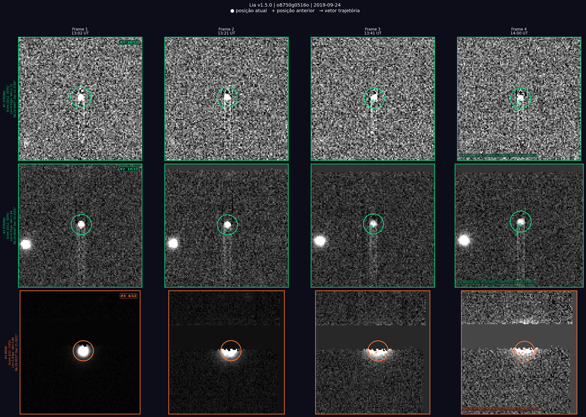

[Leia em Portugues do Brasil](README.pt-BR.md)

# Lia

**Lia** is a Python tool that helps students, teachers, and citizen-science teams pre-screen moving-object candidates in IASC FITS image sets before manual review in Astrometrica.

It looks through a four-image sequence, detects point-like sources, searches for objects that move consistently against the fixed star background, ranks the candidates, and writes reports that can guide human inspection.

Lia is a support tool. It does **not** confirm asteroid discoveries, replace Astrometrica, replace the Minor Planet Center (MPC), or replace the official IASC campaign workflow.

> The name **Lia** is used as a project name and personal dedication by the author. It is not an acronym.

- **Author:** Jaciana Barbosa
- **Repository:** `lia-astrometry`
- **Version:** `v1.5.0`
- **License:** MIT

## Why This Matters

Asteroids are small rocky bodies left over from the formation of the Solar System. Finding and measuring them helps astronomers improve orbits, identify new main-belt asteroids, and support planetary-defense work for near-Earth objects.

The **International Astronomical Search Collaboration (IASC)** is a NASA Science citizen-science project where teams inspect professional telescope images and submit validated asteroid measurements through an official campaign process.

For general asteroid-search campaigns, IASC image sets are supplied to participating teams by the campaign organizers. According to IASC, these images are provided by the Institute for Astronomy at the University of Hawaii and taken with the 1.8-m Pan-STARRS telescope on Haleakala, along the ecliptic where many asteroids are found. They are real telescope observations, not AI-generated images or synthetic pictures.

IASC campaigns are especially valuable because they let students and non-specialists participate in real astronomical work. Lia is intended to make the first screening step easier without hiding the need for careful human validation.

Sources: [NASA Science IASC project page](https://science.nasa.gov/citizen-science/international-astronomical-search-collaboration/) and [IASC campaign registration](https://iasc.cosmosearch.org/Home/Registration).

## What Lia Does

IASC/Pan-STARRS practice and campaign sets usually contain four real FITS frames of the same sky field. Most stars stay fixed from frame to frame; possible asteroids shift slightly.

Lia:

- loads the four FITS images;
- masks saturated or invalid Pan-STARRS pixels;
- estimates the local sky background;
- detects point-like sources;
- links detections across the four frames;
- rejects obvious artifacts;
- ranks the remaining candidates from `STRONG` to `DISCARDED`;
- writes JSON, text, PNG, CSV-ready, and draft MPC-style outputs.

The result is a prioritized candidate list. A high score means “inspect this first”, not “this is a confirmed asteroid”.

## Example Output



Each row is one candidate. The columns are the four frames in chronological order. Colored circles mark the measured centroid, and arrows show the motion direction.

## Quick Start

```bash
git clone https://github.com/jacianabarbosa/lia-astrometry.git
cd lia-astrometry

python3 -m venv venv
source venv/bin/activate

venv/bin/python -m pip install --upgrade pip
venv/bin/python -m pip install -r requirements.txt
venv/bin/python -m pytest tests/ -v
```

The current test suite has 92 passing tests covering source detection, WCS handling, Gaia refinement, scoring, saturation masking, JSON traceability, and CSV export.

## Basic Use

Run Lia on a folder containing exactly four `.fits` or `.fit` files:

```bash
venv/bin/python src/detector.py --images images/XY14_p10 --output results/XY14_p10
```

Useful options:

```bash
venv/bin/python src/detector.py --sigma 5.0       # more sensitive, more false positives
venv/bin/python src/detector.py --sigma 6.5       # more conservative
venv/bin/python src/detector.py --no-mpc          # skip SkyBot known-object lookup
venv/bin/python src/detector.py --wcs-mode header # use reconstructed header WCS only
venv/bin/python src/detector.py --wcs-mode gaia   # default: Gaia DR3 WCS refinement
```

Observer metadata can be passed directly or through environment variables:

```bash
venv/bin/python src/detector.py --observer "Your Name" --email "name@example.com"
export LIA_OBS="Your Name"
export LIA_EMAIL="name@example.com"
```

## Outputs

For each processed set, Lia writes:

- `*_candidates.json`: structured candidate data and run metadata;
- `*_report.txt`: readable inspection report;
- `*_MPC_report.txt`: draft auxiliary MPC-style text for review only;
- `*_candidates.png`: visual cutouts for top candidates;
- `*_pipeline.log`: audit log for the run.

Official campaign submission should still follow the normal Astrometrica/IASC process. Use Lia to decide where to look first, then inspect and measure candidates manually.

## Understanding The Score

The score is a transparent ranking heuristic from 0 to 12:

| Score | Class | Meaning |
|---:|---|---|
| 8-12 | `STRONG` | inspect first |
| 6-7 | `MODERATE` | plausible candidate |
| 4-5 | `WEAK` | low-priority candidate |
| 0-3 | `DISCARDED` | likely artifact or rejected source |

The score combines linear motion, frame-to-frame velocity consistency, flux stability, point-source morphology, elongation, and expected motion range for short IASC sequences. It is not a calibrated confidence value.

## Exporting Validation Metrics

After running several image sets, export CSV files for validation:

```bash
venv/bin/python tools/export_metrics.py results/ --out validation_metrics --recursive
```

This creates:

- `validation_metrics_sets.csv`: one row per processed set;
- `validation_metrics_candidates.csv`: one row per candidate.

The CSV includes empty manual-review columns such as `measured_in_astrometrica`, `included_in_astrometrica_mpc`, `iasc_feedback`, `manual_classification`, and `notes`.

## More Documentation

For the full scientific and technical explanation, read:

- [English methodology](docs/methodology.md)
- [Metodologia em Portugues do Brasil](docs/methodology.pt-BR.md)

Those documents explain FITS timing, background estimation, PSF fitting, Gaia DR3 refinement, header-only WCS mode, SkyBot checks, scoring, validation, limitations, and why human review remains necessary.

## Project Structure

```text
lia-astrometry/
├── README.md
├── README.pt-BR.md
├── docs/
│   ├── methodology.md
│   └── methodology.pt-BR.md
├── src/
│   └── detector.py
├── tests/
│   └── test_basic.py
├── tools/
│   └── export_metrics.py
├── requirements.txt
└── pytest.ini
```

## References

- [NASA Science: International Astronomical Search Collaboration](https://science.nasa.gov/citizen-science/international-astronomical-search-collaboration/)
- [IASC official website](https://iasc.cosmosearch.org/)
- [IASC campaign registration](https://iasc.cosmosearch.org/Home/Registration)
- Gaia Collaboration et al. (2023), *Gaia Data Release 3*, Astronomy & Astrophysics, 674, A1.
- Stetson, P. B. (1987), *DAOPHOT: A Computer Program for Crowded-Field Stellar Photometry*, PASP, 99, 191.
- Astropy Collaboration et al. (2022), *The Astropy Project*.
- IMCCE SkyBot documentation, used through `astroquery.imcce.Skybot`.
- Minor Planet Center astrometry and observation-format documentation.

## License

MIT License. See [LICENSE](LICENSE).
